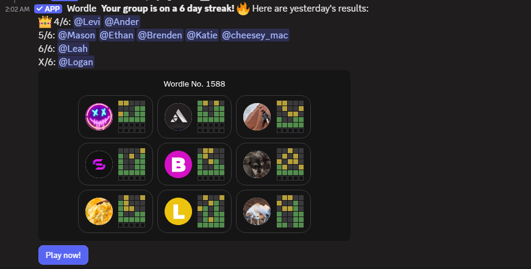

# Wordle Discord Bot
Gathers and displays statistics about Wordle games in a Discord channel or thread.
Automatically parses "streak" posts, tracks streaks and averages, and displays a leaderboard that updates when new results appear.

[Copied plaintext from streak message](assets/streakmessage.txt)
[Leaderboard message](assets/leaderboard)

## Features
Automatically detects and parses Wordle "streak' messages.
Tracks user stats (games, wins/losses, streaks, and scores).
Calculates both raw and Bayesian-adjusted averages for fairer rankings.
    Bayesian average effectively pulls everyone towards the mean. users with many scores resist the pull better.
Generates a nicely formatted leaderboard using Discord embeds.
Persists user data and processed messages in a local SQLite database.

Supports slash commands for leaderboard, catch-up parsing, and data reset.

## todo ideas
/scores to see your score.
stddev or confidence interval availability.
early poster stat (vv difficult to implement, but I would love to do it).
starter word scores
time spent pondering

## Setup
---dependencies. 
install them globally or in a venv.
the code below is intended for bash

-virtual environment steps,  skip to simplify and install deps globally.
    'python -m venv .venv'
    'source venv/Scripts/activate'
you are now using the venv
you should see a (venv) tag in your terminal
you can exit the venv via 'deactivate'

-dependency installation
    `pip install -r requirements.txt`

## Installation
[Create a bot account](https://discordpy.readthedocs.io/en/stable/discord.html)

Copy the bot token. Create a .env in the root directory and set the following variable. DISCORD_TOKEN=your_bot_token_here

set bot permissions
it needs permission to sense message content intent(read messages) and member intent (see member data, such as display name)
it also needs these permissions: send message, read message. use slash commands.

invite the bot.
I generated the invite link through the oauth2 tab becasuse i couldn't get the permissions to stick via the bot tab

## Deployment
add/invite the bot to your server, as described above. 

run it via 
    'python src/main.py'

catchup the bot up using the /catchup command.
post the current leaderboard using /leaderboard

now you can leave the bot running and it will read streak messages and update the leaderboard daily. 
